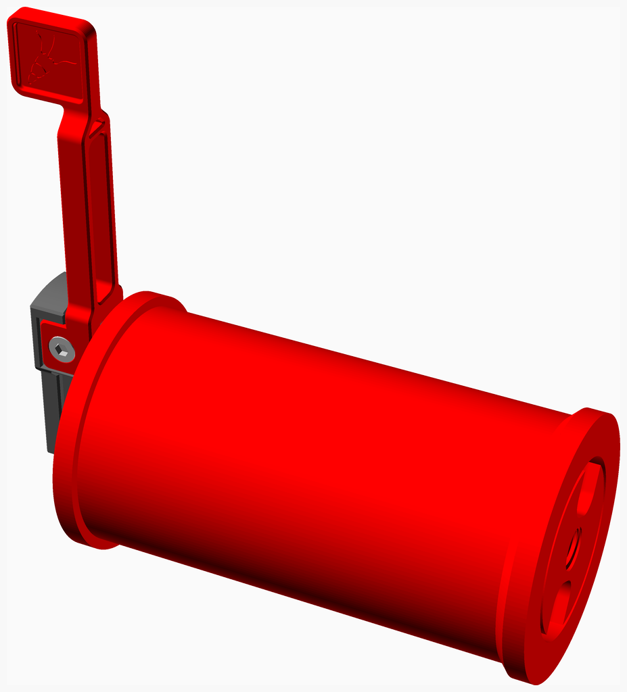
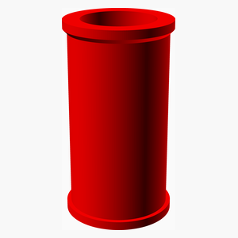
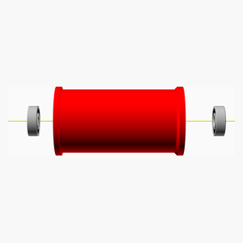
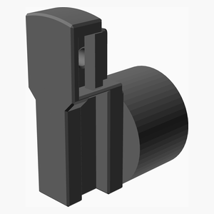
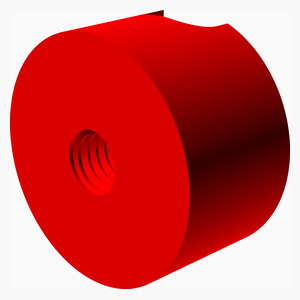
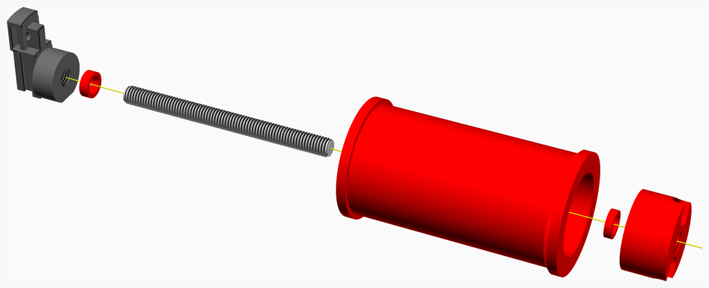

# ErcfBearingSpool
This is a bearing version of the filament spool holder of the Enraged Carrot Feeder Patch (ERCP) buffer.

The original design can be found at [ercf](https://github.com/EtteGit/EnragedRabbitProject.git).

This modification is based on the version taken on August 2023. 
It remove lots of friction compare to the original one (PTFE version).
I'm getting less failure rate with the bearing version.

It support filament spool up to 80 mm wide.

It uses two 608 bearing plus 95 mm of thread rod. That threaded rod could be M8 (metric) or 5/16" (imperial).
I provide the STL for both version.

By the way, the term "vitamin" simply mean non printer part. Apparently the origin comes from reprap [reprap](https://reprap.org/wiki/Category:Vitamin). 

Documentation generated by the OpenSCAD library [NopSCADlib](https://github.com/nophead/NopSCADlib/tree/master).

---
## Table of Contents
1. [Parts list](#Parts_list)
1. [Roll Assembly](#roll_assembly)
1. [Main Assembly](#main_assembly)

[Top](#TOP)

---

## Parts list
| Roll | Main | TOTALS |  |
|---:|---:|---:|:---|
|  |  | | **Vitamins** |
| &nbsp;&nbsp;2&nbsp; | &nbsp;&nbsp;.&nbsp; |  &nbsp;&nbsp;2&nbsp; | &nbsp;&nbsp; Ball bearing 608-2RS 8mm x 22mm x 7mm |
| &nbsp;&nbsp;.&nbsp; | &nbsp;&nbsp;1&nbsp; |  &nbsp;&nbsp;1&nbsp; | &nbsp;&nbsp; Threaded rod M8 x 95mm |
| &nbsp;&nbsp;2&nbsp; | &nbsp;&nbsp;1&nbsp; | &nbsp;&nbsp;3&nbsp; | &nbsp;&nbsp;Total vitamins count |
|  |  | | **3D printed parts** |
| &nbsp;&nbsp;.&nbsp; | &nbsp;&nbsp;1&nbsp; |  &nbsp;&nbsp;1&nbsp; | &nbsp;&nbsp;bearingSH_5_16.stl |
| &nbsp;&nbsp;.&nbsp; | &nbsp;&nbsp;1&nbsp; |  &nbsp;&nbsp;1&nbsp; | &nbsp;&nbsp;bearingSH_M8.stl |
| &nbsp;&nbsp;.&nbsp; | &nbsp;&nbsp;1&nbsp; |  &nbsp;&nbsp;1&nbsp; | &nbsp;&nbsp;nut_5_16.stl |
| &nbsp;&nbsp;.&nbsp; | &nbsp;&nbsp;1&nbsp; |  &nbsp;&nbsp;1&nbsp; | &nbsp;&nbsp;nut_M8.stl |
| &nbsp;&nbsp;1&nbsp; | &nbsp;&nbsp;.&nbsp; |  &nbsp;&nbsp;1&nbsp; | &nbsp;&nbsp;roller.stl |
| &nbsp;&nbsp;.&nbsp; | &nbsp;&nbsp;1&nbsp; |  &nbsp;&nbsp;1&nbsp; | &nbsp;&nbsp;spacer3mm.stl |
| &nbsp;&nbsp;.&nbsp; | &nbsp;&nbsp;1&nbsp; |  &nbsp;&nbsp;1&nbsp; | &nbsp;&nbsp;spacer4mm.stl |
| &nbsp;&nbsp;1&nbsp; | &nbsp;&nbsp;6&nbsp; | &nbsp;&nbsp;7&nbsp; | &nbsp;&nbsp;Total 3D printed parts count |

[Top](#TOP)

---

## Roll Assembly
### Vitamins
|Qty|Description|
|---:|:----------|
|2| Ball bearing 608-2RS 8mm x 22mm x 7mm|

### 3D Printed parts

| 1 x roller.stl |
|---|
|  

### Assembly instructions

1. Insert the bearing 608 at both end of the spool cylinder

[Top](#TOP)

---

## Main Assembly
### Vitamins
|Qty|Description|
|---:|:----------|
|1| Threaded rod M8 x 95mm|

### 3D Printed parts

| 1 x bearingSH_5_16.stl | 1 x bearingSH_M8.stl | 1 x nut_5_16.stl |
|---|---|---|
|  |  |  

| 1 x nut_M8.stl | 1 x spacer3mm.stl | 1 x spacer4mm.stl |
|---|---|---|
|  |  |  

### Sub-assemblies

| 1 x roll_assembly |
|---|
|  

### Assembly instructions

1. Remove the support.
2. Screw the threaded rod in the bearingSH. Don't overthight.
3. Insert a 4 mm spacer
4. Insert the roller
5. Insert a 3 mm spacer. You might need to use a thinner or a thicker spaced such that the nut end up flush with the roller.
6. Screw the nut. Don't overthight. Make sure the roller turn freely.
7. You can screw the handle (piece from the original design, not included here).
8. You're done.

[Top](#TOP)
